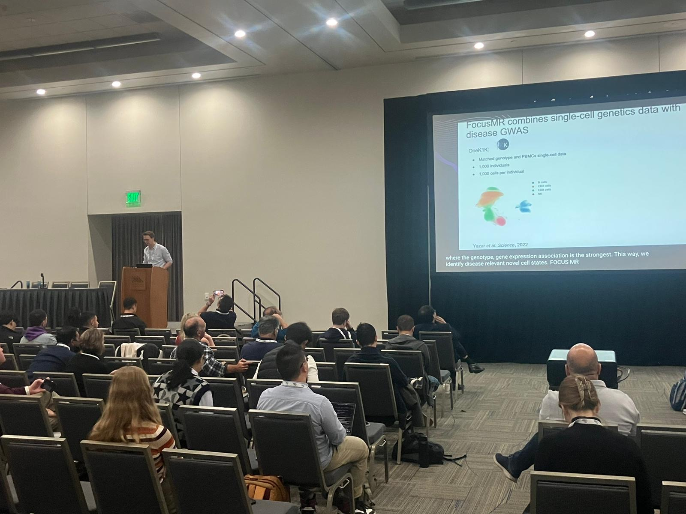
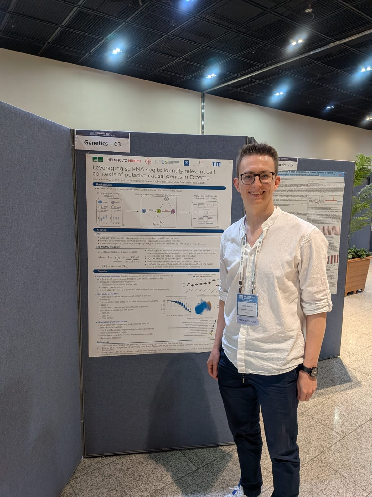
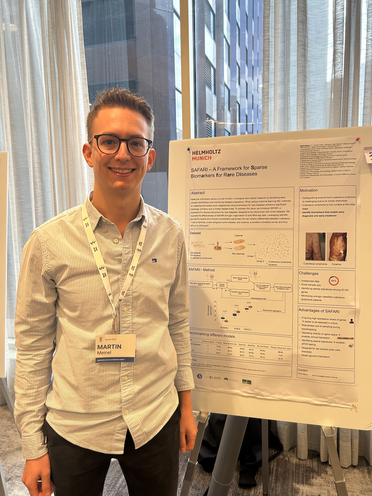

### Oral at the NeurIPS workshop: "AI Virtual Cells and Instruments: A New Era in Drug Discovery and Development"
My work on "FocusMR: An Attention-based Single-cell Mendelian Randomization Framework to map cellular contexts at candidate genes" was selected for a presentation at the NeurIPS workshop ["AI Virtual Cells and Instruments: A New Era in Drug Discovery and Development"](https://ai4d3.github.io/2025/index.html) in San Diego. I presented how we use single-cell genetics data and leverage multiple instance learning to identify disease-relevant cell states beyond cell type-level to improve disease understanding and enable precise targeting of candidate genes. 
This workshop was the highlight end of the NeurIPS week with fascinating speakers such as Eric Xing, Alex Zhavoronkov, Linda Goodman, and Arvind Ramanathan.
Their talks, ranging from automated labs, virtual cells to drug discovery were truly insightful. As a PhD candidate in computational biology, it was interesting to learn how startups work to develop target candidates and where AI can best contribute to accelerate this process.

### Poster Walk Presentation at EORTC-CLTG Meeting
In October 2025, my main PhD project on distinguishing early mycosis fungoides (MF), a rare tumor disease, from benign inflammatory skin disease earned a poster walk presentation at EORTC CLTG in Athens. In this work, we have identified the two genes _LCK_ and _HOMER1_ as diagnostic biomarkers that enable the early detection of MF and consequently allow the proper treatment of these patients. We have achieved a sensitivity and specificity of 91% and 94% in a validation cohort, respectively. Furthermore, we have tested our developed classifier on 7 international multi center cohorts. This work is now being leveraged by Dermagnostix GmbH in the research-use-only diagnostic test **Erysk**. The preprint containing more information about the two markers and the experiments is available [here](https://www.medrxiv.org/content/10.1101/2025.10.18.25338021v1).

### Industry Collaboration: Dermagnostix Visit
In July 2025, I visited our industry partners at [Dermagnostix](https://dermagnostix.com) to advance the translation of my biomarker discovery framework Safari into clinical diagnostics. As the company's CEO, Natalie Garzorz-Stark, serves as my second supervisor, this collaboration provides direct insights into automated qPCR workflows and disk-based diagnostic production processes.

As part of this ongoing collaboration, we are developing **Erysk**, currently a research-use-only clinical diagnostic tool designed to distinguish early mycosis fungoides (MF) from benign inflammatory skin conditions such as eczema and psoriasis. This work represents a direct translation of computational research into clinical applications with potential patient impact.

### Highlight Poster at RECOMB Genetics
My work on ''Leveraging single-cell RNA-seq to identify relevant cell contexts of putative causal genes in Eczema'' was selected as **highlight poster** at RECOMB Genetics, which included a teaser presentation opportunity. 

The research integrates multiple-instance learning to identify cellular contexts where expression-genotype associations manifest. Key findings show that these revealed cell states diverge from traditional cell type classifications and capture disease-relevant active genes and pathways, potentially advancing our understanding of eczema pathogenesis and informing targeted therapeutic strategies.

The conference in Seoul provided valuable networking opportunities with researchers in single-cell transcriptomics and genetics.

### Chan Zuckerberg Initiative Residency
I am honored to be part of the [Chan Zuckerberg Initiative Residency](https://chanzuckerberg.com/) since November 2024. My project on identifying cellular contexts in which genes act as disease drivers, supervised by Dr. Francesco Paolo Casale, was selected for support through this prestigious program.

The residency provides ongoing mentorship and collaboration opportunities, including regular meetings with Theofanis Karaletsos, kicked-off in person in Munich and continuing remotely, to discuss research progress and methodology.

### Published Patent: "Differential Diagnosis of Mycosis Fungoides, Method and System"
In collaboration with the Eyerich group and my supervisor Natalie Garzorz-Stark, we filed a patent in 2023 for novel diagnostic biomarkers that exhibit differential expression levels in early-stage mycosis fungoides compared to eczema and psoriasis. 

Our validation demonstrated that findings from our bulk RNA-seq discovery cohort successfully translated to an independent qPCR cohort, with concordant differential gene expression. The developed classification model accurately distinguishes between benign inflammatory skin diseases and early-stage mycosis fungoides, addressing a critical clinical need for early detection.

After 1.5 years, this patent has been published now.

### Reviewing for Machine Learning for Health workshop 2024 and RECOMB 2025
Following my participation at the [Machine Learning for Health workshop](https://ml4h.cc/2023/) 2023 in New Orleans, I served as a reviewer for the [Machine Learning for Health Symposium](https://ahli.cc/ml4h/) in Vancouver. Additionally, I was invited as a reviewer for [RECOMB 2025](https://recomb.org/recomb2025/) in Seoul, leveraging my expertise in  Mendelian Randomization methods.

### SAFARI Findings Paper accepted at [Machine Learning for Health workshop 2023](https://ml4h.cc/2023/)
My findings paper ''SAFARI - a framework for **S**parse biom**a**rker detection **f**or r**ar**e d**i**seases'' was accepted at the ''Machine Learning for Health'' workshop in New Orleans. I presented a poster on December 10th during the morning session, followed by attending NeurIPS to connect with researchers across the machine learning and health communities. 

### Patent registration "Differential diagnosis of mycosis fungoides, method and system"
Eczema and psoriasis belong to the most common inflammatory skin diseases, and share a similar phenotype with early-stage mycosis fungoides, making early and proper diagnosis challenging for dermatologists using established methods such as clinical presentation and histopathology. However, correct early diagnosis is of utmost importance for early MF patients, to not receive inappropriate therapies or progress to advanced disease stages linked to lower life expectancies.

To address this critical diagnostic gap, I developed **SAFARI** - a framework for detecting **S**parse biom**a**rkers **f**or r**ar**e d**i**seases. Using advanced machine learning approaches including feature selection and bootstrapping methods, SAFARI identified a minimal set of highly discriminative biomarkers that can distinguish mycosis fungoides from phenotypically similar benign inflammatory conditions.

Working with my collaborators from the Eyerich Lab, we patented these identified biomarkers and the discovery framework to support dermatologists in their clinical decision-making.

### EADV ESDR Summer Research Workshop in Freiburg

In July 2021, I was invited alongside my colleague Christina Hillig to present on "Biocomputational analysis of big data" at the EADV ESDR Summer Research Workshop hosted by [Kilian Eyerich](https://www.med.uni-freiburg.de/de/fakultaet/profs/Eyerich). This workshop provided an excellent opportunity to connect with scientists from diverse backgrounds — medicine, biology, and computer science — all focused on inflammatory skin disease research.

The highlight of the event was meeting my supervisor, Natalie Garzorz-Stark, and my collaborators Stefanie and Kilian Eyerich in person for the first time, allowing us to strengthen our working relationships and discuss future collaborative opportunities.